<div align="center">

# ⚡ Enterprise .NET Deployment Pipeline
### Production-Ready AKS Infrastructure with Advanced Security & Monitoring


**[Features](#-what-makes-this-special)** • **[Quick Start](#-get-started-in-5-minutes)** • **[Architecture](#-system-architecture)** • **[Security](#-security-layers)** • **[Documentation](#-full-documentation)**

---

</div>

## 🎯 What Makes This Special?

<table>
<tr>
<td width="33%" valign="top">

### 🔐 Security First
- Multi-layer vulnerability scanning
- Zero secrets in repository
- Azure Key Vault integration
- RBAC & Network policies
- Automated compliance checks

</td>
<td width="33%" valign="top">

### 🚀 Production Ready
- Auto-scaling (3-10 pods)
- High availability setup
- Load balancing
- Health checks & monitoring
- Zero-downtime deployments

</td>
<td width="33%" valign="top">

### 🤖 Fully Automated
- CI/CD with Jenkins & Azure DevOps
- Infrastructure as Code
- Automated testing
- Container image scanning
- Helm-based deployments

</td>
</tr>
</table>

---

## ⚡ Get Started in 5 Minutes

```bash
# 1. Clone repository
git clone https://github.com/your-org/dotnet-aks-app.git && cd dotnet-aks-app

# 2. Login to Azure
az login && az account set --subscription "YOUR_SUBSCRIPTION_ID"

# 3. Run automated setup
chmod +x scripts/setup-all.sh && ./scripts/setup-all.sh

# 4. Deploy application
kubectl apply -f k8s/

# 5. Get your app URL
kubectl get ingress -n dotnet-prod
```

**🎉 That's it! Your application is now running on AKS with full CI/CD pipeline.**

---

## 🏗️ System Architecture

```mermaid
graph TB
    A[👨‍💻 Developer] -->|git push| B[📦 GitHub]
    B -->|webhook| C[🔨 Jenkins CI]
    C -->|1. Build| D[.NET App]
    C -->|2. Test| E[xUnit Tests]
    C -->|3. Scan| F[SonarQube]
    C -->|4. Check| G[OWASP]
    C -->|5. Scan| H[Trivy]
    C -->|6. Push| I[🐳 ACR]
    I -->|trigger| J[🚀 Azure DevOps]
    J -->|helm deploy| K[☸️ AKS Cluster]
    K --> L[🔄 Load Balancer]
    L --> M[🌐 NGINX Ingress]
    M --> N[📱 Application Pods]
    N --> O[🔑 Azure Key Vault]
    N --> P[📊 Monitoring]
```



### Component Breakdown

| Component | Technology | Purpose |
|-----------|-----------|---------|
| **Source Control** | GitHub | Version control & collaboration |
| **CI Pipeline** | Jenkins | Automated build, test & security scans |
| **CD Pipeline** | Azure DevOps | Automated deployment to AKS |
| **Container Registry** | Azure ACR | Secure image storage |
| **Orchestration** | Azure AKS | Container orchestration |
| **Package Manager** | Helm 3 | Application deployment |
| **Ingress** | NGINX | External traffic routing |
| **Secrets** | Azure Key Vault | Secure credential management |
| **Monitoring** | Azure Monitor | Observability & alerts |

---

## 📚 Full Documentation

### 🔧 Prerequisites

<details>
<summary><b>Click to expand required tools and versions</b></summary>

**Required Tools:**
- Azure CLI `>= 2.50.0` → [Install](https://docs.microsoft.com/en-us/cli/azure/install-azure-cli)
- kubectl `>= 1.28` → [Install](https://kubernetes.io/docs/tasks/tools/)
- Helm `>= 3.12` → [Install](https://helm.sh/docs/intro/install/)
- Docker `>= 24.0` → [Install](https://docs.docker.com/get-docker/)
- .NET SDK `>= 8.0` → [Install](https://dotnet.microsoft.com/download)

**Azure Services:**
- Active Azure subscription
- Service Principal with Contributor role
- Azure DevOps organization

**CI/CD Tools:**
- Jenkins server with plugins: Docker, Kubernetes, SonarQube, Azure CLI
- SonarQube server (cloud or self-hosted)

</details>

---

### 🏗️ Infrastructure Setup

<details>
<summary><b>Step 1: Create Azure Resource Group</b></summary>

```bash
az group create \
  --name rg-dotnet-aks-prod \
  --location eastus
```

**What this does:** Creates a logical container for all Azure resources in the East US region.

</details>

<details>
<summary><b>Step 2: Setup Virtual Network</b></summary>

```bash
az network vnet create \
  --resource-group rg-dotnet-aks-prod \
  --name aks-vnet \
  --address-prefix 10.0.0.0/16 \
  --subnet-name aks-subnet \
  --subnet-prefix 10.0.1.0/24
```

**What this does:** Creates a virtual network with CIDR 10.0.0.0/16 and a subnet for AKS nodes.

</details>

<details>
<summary><b>Step 3: Create Azure Container Registry</b></summary>

```bash
az acr create \
  --resource-group rg-dotnet-aks-prod \
  --name dotnetacrprod \
  --sku Premium \
  --admin-enabled false
```

**What this does:** Creates a Premium SKU container registry for storing Docker images with geo-replication capability.

**Login to ACR:**
```bash
az acr login --name dotnetacrprod
```

</details>

<details>
<summary><b>Step 4: Setup Azure Key Vault</b></summary>

```bash
# Create Key Vault
az keyvault create \
  --name kv-dotnet-prod \
  --resource-group rg-dotnet-aks-prod \
  --location eastus \
  --enable-rbac-authorization false

# Store database connection string
az keyvault secret set \
  --vault-name kv-dotnet-prod \
  --name DbConnectionString \
  --value "Server=sql.example.com;Database=mydb;User=appuser;Password=SecureP@ssw0rd"

# Store API keys
az keyvault secret set \
  --vault-name kv-dotnet-prod \
  --name ApiKey \
  --value "your-api-key-here"
```

**What this does:** Creates a secure vault for storing application secrets and credentials.

</details>

<details>
<summary><b>Step 5: Deploy AKS Cluster</b></summary>

```bash
# Get subnet ID
SUBNET_ID=$(az network vnet subnet show \
  --resource-group rg-dotnet-aks-prod \
  --vnet-name aks-vnet \
  --name aks-subnet \
  --query id -o tsv)

# Create production AKS cluster
az aks create \
  --resource-group rg-dotnet-aks-prod \
  --name dotnet-aks \
  --node-count 3 \
  --node-vm-size Standard_D4s_v5 \
  --network-plugin azure \
  --vnet-subnet-id $SUBNET_ID \
  --enable-managed-identity \
  --enable-addons monitoring \
  --enable-azure-policy \
  --enable-cluster-autoscaler \
  --min-count 3 \
  --max-count 6 \
  --attach-acr dotnetacrprod \
  --kubernetes-version 1.28.3
```

**What this does:** Deploys a production-grade AKS cluster with:
- 3 nodes (auto-scales to 6)
- Azure CNI networking
- Managed identity
- Container monitoring
- ACR integration

**Get credentials:**
```bash
az aks get-credentials \
  --resource-group rg-dotnet-aks-prod \
  --name dotnet-aks
```

</details>

<details>
<summary><b>Step 6: Install NGINX Ingress Controller</b></summary>

```bash
# Add Helm repository
helm repo add ingress-nginx https://kubernetes.github.io/ingress-nginx
helm repo update

# Install NGINX Ingress
helm install nginx-ingress ingress-nginx/ingress-nginx \
  --namespace ingress-nginx \
  --create-namespace \
  --set controller.replicaCount=2 \
  --set controller.nodeSelector."kubernetes\.io/os"=linux \
  --set controller.service.type=LoadBalancer

# Get external IP
kubectl get service -n ingress-nginx nginx-ingress-ingress-nginx-controller
```

**What this does:** Deploys NGINX ingress controller with 2 replicas for high availability.

</details>

---

### 🐳 Application Configuration

<details>
<summary><b>Dockerfile for .NET 8 Application</b></summary>

```dockerfile
# Build stage
FROM mcr.microsoft.com/dotnet/sdk:8.0 AS build
WORKDIR /src
COPY ["src/DotNetApp/DotNetApp.csproj", "DotNetApp/"]
RUN dotnet restore "DotNetApp/DotNetApp.csproj"
COPY src/DotNetApp/. DotNetApp/
WORKDIR "/src/DotNetApp"
RUN dotnet build "DotNetApp.csproj" -c Release -o /app/build

# Publish stage
FROM build AS publish
RUN dotnet publish "DotNetApp.csproj" -c Release -o /app/publish

# Runtime stage
FROM mcr.microsoft.com/dotnet/aspnet:8.0 AS runtime
WORKDIR /app
COPY --from=publish /app/publish .
EXPOSE 80
ENTRYPOINT ["dotnet", "DotNetApp.dll"]
```

</details>

<details>
<summary><b>Kubernetes Manifests</b></summary>

**namespace.yaml**
```yaml
apiVersion: v1
kind: Namespace
metadata:
  name: dotnet-prod
  labels:
    name: dotnet-prod
    environment: production
```

**deployment.yaml**
```yaml
apiVersion: apps/v1
kind: Deployment
metadata:
  name: dotnet-app
  namespace: dotnet-prod
  labels:
    app: dotnet-app
    version: v1
spec:
  replicas: 3
  selector:
    matchLabels:
      app: dotnet-app
  template:
    metadata:
      labels:
        app: dotnet-app
        version: v1
    spec:
      containers:
      - name: dotnet-app
        image: dotnetacrprod.azurecr.io/dotnet-app:latest
        imagePullPolicy: Always
        ports:
        - containerPort: 80
          protocol: TCP
        env:
        - name: ASPNETCORE_ENVIRONMENT
          value: "Production"
        - name: DB_CONNECTION
          valueFrom:
            secretKeyRef:
              name: app-secrets
              key: db-connection
        resources:
          requests:
            cpu: "200m"
            memory: "256Mi"
          limits:
            cpu: "500m"
            memory: "512Mi"
        livenessProbe:
          httpGet:
            path: /health
            port: 80
          initialDelaySeconds: 30
          periodSeconds: 10
        readinessProbe:
          httpGet:
            path: /health/ready
            port: 80
          initialDelaySeconds: 5
          periodSeconds: 5
```

**service.yaml**
```yaml
apiVersion: v1
kind: Service
metadata:
  name: dotnet-svc
  namespace: dotnet-prod
spec:
  type: ClusterIP
  selector:
    app: dotnet-app
  ports:
  - name: http
    port: 80
    targetPort: 80
    protocol: TCP
```

**ingress.yaml**
```yaml
apiVersion: networking.k8s.io/v1
kind: Ingress
metadata:
  name: dotnet-ingress
  namespace: dotnet-prod
  annotations:
    nginx.ingress.kubernetes.io/rewrite-target: /
    nginx.ingress.kubernetes.io/ssl-redirect: "true"
    cert-manager.io/cluster-issuer: "letsencrypt-prod"
spec:
  ingressClassName: nginx
  tls:
  - hosts:
    - dotnet.example.com
    secretName: dotnet-tls
  rules:
  - host: dotnet.example.com
    http:
      paths:
      - path: /
        pathType: Prefix
        backend:
          service:
            name: dotnet-svc
            port:
              number: 80
```

**hpa.yaml**
```yaml
apiVersion: autoscaling/v2
kind: HorizontalPodAutoscaler
metadata:
  name: dotnet-hpa
  namespace: dotnet-prod
spec:
  scaleTargetRef:
    apiVersion: apps/v1
    kind: Deployment
    name: dotnet-app
  minReplicas: 3
  maxReplicas: 10
  metrics:
  - type: Resource
    resource:
      name: cpu
      target:
        type: Utilization
        averageUtilization: 70
  - type: Resource
    resource:
      name: memory
      target:
        type: Utilization
        averageUtilization: 80
  behavior:
    scaleDown:
      stabilizationWindowSeconds: 300
      policies:
      - type: Percent
        value: 50
        periodSeconds: 15
    scaleUp:
      stabilizationWindowSeconds: 0
      policies:
      - type: Percent
        value: 100
        periodSeconds: 15
      - type: Pods
        value: 2
        periodSeconds: 15
      selectPolicy: Max
```

</details>

---

### 🔄 CI/CD Pipeline Configuration

<details>
<summary><b>Jenkins CI Pipeline (Jenkinsfile)</b></summary>

```groovy
pipeline {
    agent any

    tools {
        dotnet 'dotnet8'
    }

    environment {
        ACR = "dotnetacrprod.azurecr.io"
        IMAGE = "dotnet-app"
        TAG = "${BUILD_NUMBER}"
        SONAR_PROJECT = "dotnet-app"
    }

    stages {
        stage('🔍 Checkout') {
            steps {
                echo '📥 Checking out code from GitHub...'
                git branch: 'main', url: 'https://github.com/org/dotnet-app.git'
            }
        }

        stage('🔧 Restore Dependencies') {
            steps {
                echo '📦 Restoring NuGet packages...'
                sh 'dotnet restore'
            }
        }

        stage('🏗️ Build Application') {
            steps {
                echo '🔨 Building .NET application...'
                sh 'dotnet build --no-restore --configuration Release'
            }
        }

        stage('🧪 Run Unit Tests') {
            steps {
                echo '🧪 Running xUnit tests with code coverage...'
                sh '''
                    dotnet test \
                        --no-build \
                        --configuration Release \
                        --collect:"XPlat Code Coverage" \
                        --logger "trx;LogFileName=test-results.trx"
                '''
            }
            post {
                always {
                    junit '**/test-results.trx'
                }
            }
        }

        stage('📊 SonarQube Analysis') {
            steps {
                echo '📊 Running SonarQube code analysis...'
                withSonarQubeEnv('sonarqube') {
                    sh '''
                        dotnet sonarscanner begin \
                            /k:"${SONAR_PROJECT}" \
                            /d:sonar.host.url="${SONAR_HOST_URL}" \
                            /d:sonar.login="${SONAR_AUTH_TOKEN}"
                        dotnet build --configuration Release
                        dotnet sonarscanner end /d:sonar.login="${SONAR_AUTH_TOKEN}"
                    '''
                }
            }
        }

        stage('🛡️ OWASP Dependency Check') {
            steps {
                echo '🔍 Scanning for vulnerable dependencies...'
                sh '''
                    dependency-check.sh \
                        --project "${IMAGE}" \
                        --scan . \
                        --format HTML \
                        --format JSON \
                        --out dependency-check-report
                '''
            }
            post {
                always {
                    publishHTML([
                        allowMissing: false,
                        alwaysLinkToLastBuild: true,
                        keepAll: true,
                        reportDir: 'dependency-check-report',
                        reportFiles: 'dependency-check-report.html',
                        reportName: 'OWASP Dependency Check'
                    ])
                }
            }
        }

        stage('📦 Publish Application') {
            steps {
                echo '📦 Publishing .NET application...'
                sh 'dotnet publish -c Release -o publish'
            }
        }

        stage('🐳 Build Docker Image') {
            steps {
                echo '🐳 Building Docker image...'
                sh '''
                    docker build \
                        -t ${ACR}/${IMAGE}:${TAG} \
                        -t ${ACR}/${IMAGE}:latest \
                        .
                '''
            }
        }

        stage('🔒 Trivy Security Scan') {
            steps {
                echo '🔍 Scanning Docker image for vulnerabilities...'
                sh '''
                    trivy image \
                        --severity HIGH,CRITICAL \
                        --exit-code 1 \
                        --no-progress \
                        ${ACR}/${IMAGE}:${TAG}
                '''
            }
        }

        stage('🚀 Push to ACR') {
            steps {
                echo '📤 Pushing image to Azure Container Registry...'
                withCredentials([usernamePassword(
                    credentialsId: 'acr-credentials',
                    usernameVariable: 'ACR_USER',
                    passwordVariable: 'ACR_PASSWORD'
                )]) {
                    sh '''
                        echo ${ACR_PASSWORD} | docker login ${ACR} -u ${ACR_USER} --password-stdin
                        docker push ${ACR}/${IMAGE}:${TAG}
                        docker push ${ACR}/${IMAGE}:latest
                    '''
                }
            }
        }

        stage('📝 Update Manifest') {
            steps {
                echo '📝 Updating Kubernetes manifest with new image tag...'
                sh '''
                    sed -i "s|image: .*|image: ${ACR}/${IMAGE}:${TAG}|g" k8s/deployment.yaml
                    git add k8s/deployment.yaml
                    git commit -m "Update image to ${TAG}" || true
                '''
            }
        }
    }

    post {
        success {
            echo '✅ Pipeline completed successfully!'
            slackSend(
                color: 'good',
                message: "✅ Build #${BUILD_NUMBER} succeeded for ${IMAGE}:${TAG}"
            )
        }
        failure {
            echo '❌ Pipeline failed!'
            slackSend(
                color: 'danger',
                message: "❌ Build #${BUILD_NUMBER} failed for ${IMAGE}"
            )
        }
        always {
            cleanWs()
        }
    }
}
```

</details>

<details>
<summary><b>Azure DevOps CD Pipeline (azure-pipelines.yml)</b></summary>

```yaml
trigger: none

variables:
  aksResourceGroup: 'rg-dotnet-aks-prod'
  aksCluster: 'dotnet-aks'
  namespace: 'dotnet-prod'
  helmChartPath: './helm'

stages:
- stage: Deploy_to_AKS
  displayName: '🚀 Deploy to AKS'
  jobs:
  - job: Deploy
    displayName: 'Deploy Application'
    pool:
      vmImage: 'ubuntu-latest'
    
    steps:
    - task: HelmInstaller@1
      displayName: '📦 Install Helm'
      inputs:
        helmVersionToInstall: 'latest'

    - task: AzureCLI@2
      displayName: '🔐 Get AKS Credentials'
      inputs:
        azureSubscription: 'Azure-Prod-Service-Connection'
        scriptType: 'bash'
        scriptLocation: 'inlineScript'
        inlineScript: |
          az aks get-credentials \
            --resource-group $(aksResourceGroup) \
            --name $(aksCluster) \
            --overwrite-existing

    - task: Bash@3
      displayName: '✅ Verify Connection'
      inputs:
        targetType: 'inline'
        script: |
          echo "🔍 Checking cluster connection..."
          kubectl cluster-info
          kubectl get nodes

    - task: Bash@3
      displayName: '🎯 Create Namespace'
      inputs:
        targetType: 'inline'
        script: |
          kubectl create namespace $(namespace) --dry-run=client -o yaml | kubectl apply -f -

    - task: HelmDeploy@0
      displayName: '🚀 Deploy with Helm'
      inputs:
        connectionType: 'Kubernetes Service Connection'
        namespace: '$(namespace)'
        command: 'upgrade'
        chartType: 'FilePath'
        chartPath: '$(helmChartPath)'
        releaseName: 'dotnet-app'
        arguments: |
          --install \
          --create-namespace \
          --set image.repository=dotnetacrprod.azurecr.io/dotnet-app \
          --set image.tag=$(Build.BuildId) \
          --set ingress.enabled=true \
          --set ingress.hosts[0].host=dotnet.example.com \
          --set ingress.hosts[0].paths[0].path=/ \
          --set ingress.hosts[0].paths[0].pathType=Prefix \
          --wait \
          --timeout 5m

    - task: Bash@3
      displayName: '🔍 Verify Deployment'
      inputs:
        targetType: 'inline'
        script: |
          echo "📊 Checking deployment status..."
          kubectl rollout status deployment/dotnet-app -n $(namespace)
          kubectl get pods -n $(namespace)
          kubectl get svc -n $(namespace)
          kubectl get ingress -n $(namespace)

    - task: Bash@3
      displayName: '📧 Send Notification'
      condition: always()
      inputs:
        targetType: 'inline'
        script: |
          if [ "$(Agent.JobStatus)" == "Succeeded" ]; then
            echo "✅ Deployment successful!"
          else
            echo "❌ Deployment failed!"
            exit 1
          fi
```

</details>

---

### 🔒 Security Layers

<table>
<tr>
<th>Layer</th>
<th>Tool</th>
<th>What It Does</th>
<th>When It Runs</th>
</tr>
<tr>
<td><b>Code Quality</b></td>
<td>SonarQube</td>
<td>Detects bugs, code smells, security vulnerabilities in source code</td>
<td>Every CI build</td>
</tr>
<tr>
<td><b>Dependencies</b></td>
<td>OWASP Dependency Check</td>
<td>Identifies known vulnerabilities in NuGet packages and libraries</td>
<td>Every CI build</td>
</tr>
<tr>
<td><b>Container Image</b></td>
<td>Trivy</td>
<td>Scans Docker images for CVEs, misconfigurations, and secrets</td>
<td>Before pushing to ACR</td>
</tr>
<tr>
<td><b>Secrets</b></td>
<td>Azure Key Vault</td>
<td>Stores and manages sensitive data (API keys, connection strings)</td>
<td>Runtime</td>
</tr>
<tr>
<td><b>Cluster Policy</b></td>
<td>Azure Policy</td>
<td>Enforces organizational standards and compliance requirements</td>
<td>Continuous</td>
</tr>
<tr>
<td><b>Network</b></td>
<td>NSG + Private AKS</td>
<td>Controls inbound/outbound traffic, network isolation</td>
<td>Continuous</td>
</tr>
<tr>
<td><b>Access Control</b></td>
<td>RBAC</td>
<td>Manages user permissions with least privilege principle</td>
<td>Continuous</td>
</tr>
</table>

---

### 📊 Monitoring & Observability

<details>
<summary><b>Azure Monitor for Containers</b></summary>

**Enable monitoring:**
```bash
az aks enable-addons \
  --resource-group rg-dotnet-aks-prod \
  --name dotnet-aks \
  --addons monitoring
```

**View logs:**
```bash
az monitor log-analytics workspace list
```

**Key metrics tracked:**
- Container CPU/Memory usage
- Node health and performance
- Pod restart counts
- Network traffic patterns
- Application exceptions

</details>

<details>
<summary><b>Application Insights Integration</b></summary>

**Add to your .NET application:**

```csharp
// Program.cs
builder.Services.AddApplicationInsightsTelemetry();
```

**appsettings.json:**
```json
{
  "ApplicationInsights": {
    "ConnectionString": "InstrumentationKey=your-key-here"
  },
  "Logging": {
    "ApplicationInsights": {
      "LogLevel": {
        "Default": "Information"
      }
    }
  }
}
```

**Metrics collected:**
- Request rates and response times
- Dependency calls
- Exception tracking
- Custom events and metrics
- User analytics

</details>

<details>
<summary><b>Optional: Prometheus + Grafana</b></summary>

```bash
# Install Prometheus stack
helm repo add prometheus-community https://prometheus-community.github.io/helm-charts
helm repo update

helm install prometheus prometheus-community/kube-prometheus-stack \
  --namespace monitoring \
  --create-namespace \
  --set prometheus.prometheusSpec.retention=30d \
  --set grafana.adminPassword=YourSecurePassword

# Access Grafana dashboard
kubectl port-forward -n monitoring svc/prometheus-grafana 3000:80

# Access Prometheus
kubectl port-forward -n monitoring svc/prometheus-kube-prometheus-prometheus 9090:9090
```

**Pre-built dashboards available for:**
- Kubernetes cluster overview
- Node exporter metrics
- Pod resource usage
- Application performance

</details>

---

### 🔧 Troubleshooting Guide

<details>
<summary><b>Common Issues & Solutions</b></summary>

#### Issue 1: ImagePullBackOff Error

**Symptoms:** Pods stuck in `ImagePullBackOff` or `ErrImagePull` state

**Solution:**
```bash
# Re-attach ACR to AKS
az aks update \
  --resource-group rg-dotnet-aks-prod \
  --name dotnet-aks \
  --attach-acr dotnetacrprod

# Verify ACR integration
az aks check-acr \
  --resource-group rg-dotnet-aks-prod \
  --name dotnet-aks \
  --acr dotnetacrprod.azurecr.io
```

#### Issue 2: Application Not Accessible

**Symptoms:** Cannot reach application via ingress URL

**Diagnosis:**
```bash
# Check ingress controller
kubectl get pods -n ingress-nginx
kubectl logs -n ingress-nginx deployment/nginx-ingress-ingress-nginx-controller

# Check ingress resource
kubectl describe ingress dotnet-ingress -n dotnet-prod

# Verify service
kubectl get svc -n dotnet-prod
kubectl describe svc dotnet-svc -n dotnet-prod

# Check pod status
kubectl get pods -n dotnet-prod
kubectl logs deployment/dotnet-app -n dotnet-prod
```

**Solution:**
```bash
# Restart ingress controller if needed
kubectl rollout restart deployment nginx-ingress-ingress-nginx-controller -n ingress-nginx

# Update DNS to point to ingress external IP
kubectl get svc -n ingress-nginx
```

#### Issue 3: High Resource Usage

**Symptoms:** Pods consuming excessive CPU/memory

**Diagnosis:**
```bash
# Check resource usage
kubectl top pods -n dotnet-prod
kubectl top nodes

# View detailed pod metrics
kubectl describe pod <pod-name> -n dotnet-prod
```

**Solution:**
```bash
# Scale deployment manually
kubectl scale deployment dotnet-app -n dotnet-prod --replicas=5

# Adjust resource limits in deployment
kubectl edit deployment dotnet-app -n dotnet-prod

# Check HPA status
kubectl get hpa -n dotnet-prod
kubectl describe hpa dotnet-hpa -n dotnet-prod
```

#### Issue 4: Pod CrashLoopBackOff

**Symptoms:** Pods continuously restarting

**Diagnosis:**
```bash
# View pod logs
kubectl logs <pod-name> -n dotnet-prod --previous

# Check events
kubectl get events -n dotnet-prod --sort-by='.lastTimestamp'

# Describe pod for details
kubectl describe pod <pod-name> -n dotnet-prod
```

**Common causes:**
- Application configuration error
- Missing environment variables
- Health check failures
- Resource constraints

</details>

<details>
<summary><b>Useful Commands Cheat Sheet</b></summary>

```bash
# ===== CLUSTER INFO =====
kubectl cluster-info
kubectl get nodes
kubectl version

# ===== POD MANAGEMENT =====
kubectl get pods -n dotnet-prod
kubectl logs -f deployment/dotnet-app -n dotnet-prod
kubectl exec -it <pod-name> -n dotnet-prod -- /bin/bash
kubectl describe pod <pod-name> -n dotnet-prod

# ===== DEPLOYMENT =====
kubectl get deployments -n dotnet-prod
kubectl rollout status deployment/dotnet-app -n dotnet-prod
kubectl rollout restart deployment/dotnet-app -n dotnet-prod
kubectl rollout undo deployment/dotnet-app -n dotnet-prod

# ===== SCALING =====
kubectl scale deployment dotnet-app -n dotnet-prod --replicas=5
kubectl get hpa -n dotnet-prod
kubectl autoscale deployment dotnet-app --cpu-percent=70 --min=3 --max=10

# ===== SERVICES & INGRESS =====
kubectl get svc -n dotnet-prod
kubectl get ingress -n dotnet-prod
kubectl describe ingress dotnet-ingress -n dotnet-prod

# ===== RESOURCE MONITORING =====
kubectl top nodes
kubectl top pods -n dotnet-prod
kubectl describe node <node-name>

# ===== EVENTS & DEBUGGING =====
kubectl get events -n dotnet-prod --sort-by='.lastTimestamp'
kubectl get events -A --sort-by='.lastTimestamp' | head -20

# ===== SECRETS & CONFIGMAPS =====
kubectl get secrets -n dotnet-prod
kubectl describe secret app-secrets -n dotnet-prod
kubectl get configmaps -n dotnet-prod

# ===== NAMESPACE OPERATIONS =====
kubectl get namespaces
kubectl config set-context --current --namespace=dotnet-prod

# ===== CLEANUP =====
kubectl delete deployment dotnet-app -n dotnet-prod
kubectl delete namespace dotnet-prod
```

</details>

---

### 📂 Project Structure

```
dotnet-aks-app/
│
├── 📁 src/
│   ├── DotNetApp/
│   │   ├── Controllers/
│   │   │   ├── HomeController.cs
│   │   │   └── HealthController.cs
│   │   ├── Models/
│   │   │   └── ApplicationModels.cs
│   │   ├── Services/
│   │   │   └── BusinessService.cs
│   │   ├── Program.cs
│   │   ├── appsettings.json
│   │   └── DotNetApp.csproj
│   │
│   └── DotNetApp.Tests/
│       ├── UnitTests/
│       │   ├── ControllerTests.cs
│       │   └── ServiceTests.cs
│       └── DotNetApp.Tests.csproj
│
├── 📁 k8s/
│   ├── namespace.yaml
│   ├── deployment.yaml
│   ├── service.yaml
│   ├── ingress.yaml
│   ├── hpa.yaml
│   └── secrets.yaml
│
├── 📁 helm/
│   ├── Chart.yaml
│   ├── values.yaml
│   ├── values-dev.yaml
│   ├── values-prod.yaml
│   └── templates/
│       ├── deployment.yaml
│       ├── service.yaml
│       ├── ingress.yaml
│       ├── hpa.yaml
│       └── _helpers.tpl
│
├── 📁 scripts/
│   ├── setup-infrastructure.sh
│   ├── setup-monitoring.sh
│   ├── deploy.sh
│   └── cleanup.sh
│
├── 📁 .github/
│   └── workflows/
│       └── ci.yml
│
├── 📄 Dockerfile
├── 📄 .dockerignore
├── 📄 Jenkinsfile
├── 📄 azure-pipelines.yml
├── 📄 .gitignore
├── 📄 README.md
└── 📄 LICENSE
```

---

## 🎯 Advanced Features

### 🔄 Blue-Green Deployment

<details>
<summary><b>Click to see Blue-Green deployment strategy</b></summary>

```yaml
# blue-deployment.yaml
apiVersion: apps/v1
kind: Deployment
metadata:
  name: dotnet-app-blue
  namespace: dotnet-prod
spec:
  replicas: 3
  selector:
    matchLabels:
      app: dotnet-app
      version: blue
  template:
    metadata:
      labels:
        app: dotnet-app
        version: blue
    spec:
      containers:
      - name: dotnet-app
        image: dotnetacrprod.azurecr.io/dotnet-app:v1.0.0
        ports:
        - containerPort: 80
---
# green-deployment.yaml
apiVersion: apps/v1
kind: Deployment
metadata:
  name: dotnet-app-green
  namespace: dotnet-prod
spec:
  replicas: 3
  selector:
    matchLabels:
      app: dotnet-app
      version: green
  template:
    metadata:
      labels:
        app: dotnet-app
        version: green
    spec:
      containers:
      - name: dotnet-app
        image: dotnetacrprod.azurecr.io/dotnet-app:v2.0.0
        ports:
        - containerPort: 80
---
# service.yaml (switch between blue/green)
apiVersion: v1
kind: Service
metadata:
  name: dotnet-svc
  namespace: dotnet-prod
spec:
  selector:
    app: dotnet-app
    version: blue  # Change to 'green' to switch traffic
  ports:
  - port: 80
    targetPort: 80
```

**Switch traffic:**
```bash
# Deploy green version
kubectl apply -f green-deployment.yaml

# Test green deployment
kubectl port-forward deployment/dotnet-app-green 8080:80 -n dotnet-prod

# Switch traffic to green
kubectl patch service dotnet-svc -n dotnet-prod -p '{"spec":{"selector":{"version":"green"}}}'

# Rollback if needed
kubectl patch service dotnet-svc -n dotnet-prod -p '{"spec":{"selector":{"version":"blue"}}}'
```

</details>

### 🔐 SSL/TLS with Cert-Manager

<details>
<summary><b>Setup automatic SSL certificates</b></summary>

```bash
# Install cert-manager
kubectl apply -f https://github.com/cert-manager/cert-manager/releases/download/v1.13.0/cert-manager.yaml

# Create ClusterIssuer
cat <<EOF | kubectl apply -f -
apiVersion: cert-manager.io/v1
kind: ClusterIssuer
metadata:
  name: letsencrypt-prod
spec:
  acme:
    server: https://acme-v02.api.letsencrypt.org/directory
    email: admin@example.com
    privateKeySecretRef:
      name: letsencrypt-prod
    solvers:
    - http01:
        ingress:
          class: nginx
EOF
```

**Update ingress for SSL:**
```yaml
apiVersion: networking.k8s.io/v1
kind: Ingress
metadata:
  name: dotnet-ingress
  namespace: dotnet-prod
  annotations:
    cert-manager.io/cluster-issuer: "letsencrypt-prod"
    nginx.ingress.kubernetes.io/ssl-redirect: "true"
spec:
  ingressClassName: nginx
  tls:
  - hosts:
    - dotnet.example.com
    secretName: dotnet-tls-secret
  rules:
  - host: dotnet.example.com
    http:
      paths:
      - path: /
        pathType: Prefix
        backend:
          service:
            name: dotnet-svc
            port:
              number: 80
```

</details>

### 📊 Custom Metrics & Dashboards

<details>
<summary><b>Setup custom Grafana dashboard</b></summary>

**Create custom dashboard JSON:**
```json
{
  "dashboard": {
    "title": ".NET Application Metrics",
    "panels": [
      {
        "title": "Request Rate",
        "targets": [
          {
            "expr": "rate(http_requests_total[5m])"
          }
        ]
      },
      {
        "title": "Response Time",
        "targets": [
          {
            "expr": "histogram_quantile(0.95, rate(http_request_duration_seconds_bucket[5m]))"
          }
        ]
      }
    ]
  }
}
```

**Import to Grafana:**
```bash
# Port forward to Grafana
kubectl port-forward -n monitoring svc/prometheus-grafana 3000:80

# Access at http://localhost:3000
# Login: admin / YourSecurePassword
# Import dashboard from JSON
```

</details>

---

## 🚦 Performance Optimization

### Resource Optimization Tips

| Resource | Recommendation | Reason |
|----------|---------------|--------|
| **CPU Request** | 200m - 500m | Balance between cost and performance |
| **Memory Request** | 256Mi - 512Mi | Adequate for .NET 8 applications |
| **CPU Limit** | 500m - 1000m | Prevent resource hogging |
| **Memory Limit** | 512Mi - 1Gi | Avoid OOMKilled errors |
| **Replicas** | Min: 3, Max: 10 | High availability with cost control |

### Application Performance

```csharp
// Enable response compression
builder.Services.AddResponseCompression(options =>
{
    options.EnableForHttps = true;
});

// Configure Kestrel for production
builder.WebHost.ConfigureKestrel(serverOptions =>
{
    serverOptions.Limits.MaxConcurrentConnections = 100;
    serverOptions.Limits.MaxRequestBodySize = 10 * 1024 * 1024; // 10MB
});

// Add health checks
builder.Services.AddHealthChecks()
    .AddCheck("self", () => HealthCheckResult.Healthy())
    .AddCheck("database", () => CheckDatabaseConnection());
```

---

## 🤝 Contributing

We love contributions! Here's how you can help:

### Getting Started

1. **Fork** the repository
2. **Clone** your fork: `git clone https://github.com/your-username/dotnet-aks-app.git`
3. **Create** a branch: `git checkout -b feature/amazing-feature`
4. **Make** your changes
5. **Test** thoroughly
6. **Commit**: `git commit -m '✨ Add amazing feature'`
7. **Push**: `git push origin feature/amazing-feature`
8. **Open** a Pull Request

### Commit Convention

We follow [Conventional Commits](https://www.conventionalcommits.org/):

- `feat:` New feature
- `fix:` Bug fix
- `docs:` Documentation changes
- `style:` Code style changes (formatting, etc.)
- `refactor:` Code refactoring
- `test:` Adding or updating tests
- `chore:` Maintenance tasks

**Examples:**
```bash
git commit -m "feat: add health check endpoint"
git commit -m "fix: resolve memory leak in service layer"
git commit -m "docs: update deployment instructions"
```

### Code Standards

- Follow [C# Coding Conventions](https://docs.microsoft.com/en-us/dotnet/csharp/fundamentals/coding-style/coding-conventions)
- Write unit tests (target: 80% code coverage)
- Update documentation for new features
- Ensure all CI/CD checks pass
- Add comments for complex logic

---

## 📞 Support & Contact

<div align="center">

### Need Help?

| Channel | Link | Response Time |
|---------|------|---------------|
| 🐛 **Bug Reports** | [GitHub Issues](https://github.com/your-org/dotnet-aks-app/issues) | 24-48 hours |
| 💡 **Feature Requests** | [GitHub Discussions](https://github.com/your-org/dotnet-aks-app/discussions) | 1 week |
| 📧 **Email** | devops@yourcompany.com | 2-3 business days |
| 💬 **Slack** | [Join Workspace](https://yourslack.slack.com) | Real-time |
| 📚 **Documentation** | [Wiki](https://github.com/your-org/dotnet-aks-app/wiki) | - |

</div>

---

## 📜 License

This project is licensed under the **MIT License** - see the [LICENSE](LICENSE) file for details.

```
MIT License

Copyright (c) 2024 Your Company Name

Permission is hereby granted, free of charge, to any person obtaining a copy
of this software and associated documentation files (the "Software"), to deal
in the Software without restriction, including without limitation the rights
to use, copy, modify, merge, publish, distribute, sublicense, and/or sell
copies of the Software, and to permit persons to whom the Software is
furnished to do so, subject to the following conditions:

The above copyright notice and this permission notice shall be included in all
copies or substantial portions of the Software.

THE SOFTWARE IS PROVIDED "AS IS", WITHOUT WARRANTY OF ANY KIND, EXPRESS OR
IMPLIED, INCLUDING BUT NOT LIMITED TO THE WARRANTIES OF MERCHANTABILITY,
FITNESS FOR A PARTICULAR PURPOSE AND NONINFRINGEMENT.
```

---

## 🌟 Acknowledgments

Special thanks to:

- **Microsoft Azure Team** - For excellent AKS documentation
- **Kubernetes Community** - For the amazing ecosystem
- **.NET Foundation** - For the robust framework
- **Jenkins Community** - For CI/CD excellence
- **CNCF Projects** - Helm, Prometheus, and more
- **All Contributors** - You make this project better!

---

## 📈 Project Stats

<div align="center">


</div>

---

## 🗺️ Roadmap

### ✅ Completed
- [x] Basic AKS infrastructure setup
- [x] Jenkins CI pipeline with security scanning
- [x] Azure DevOps CD pipeline
- [x] Horizontal Pod Autoscaler
- [x] NGINX Ingress Controller
- [x] Azure Key Vault integration
- [x] Monitoring with Azure Monitor

### 🚧 In Progress
- [ ] Service Mesh (Istio/Linkerd)
- [ ] Advanced observability with OpenTelemetry
- [ ] GitOps with ArgoCD
- [ ] Multi-region deployment

### 📅 Planned
- [ ] Chaos engineering with Chaos Mesh
- [ ] Cost optimization automation
- [ ] Advanced security with Falco
- [ ] ML-based anomaly detection

---

<div align="center">

## ⭐ Star History

[](https://star-history.com/#your-org/dotnet-aks-app&Date)

---

### 💙 Show Your Support

If this project helped you, please consider giving it a ⭐ star!

**Made with ❤️ by the DevOps Team**

[⬆ Back to Top](#-enterprise-net-deployment-pipeline)

</div>v
